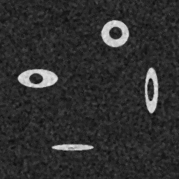

# Noise-Robust-Flood-Fill

Masking an image locally, based on mouse-defined 'seed points' and selecting connected areas including the seed points. Two-level thresholding provides noise-robustness. 

Contributors:
 
  1. Holger Lorenz (h.lorenz@zmbh.uni-heidelberg.de)
 
    Project definition and tests
 
  2. Aliakbar Jafarpour (jafarpour.a.j@ieee.org)
 
    Design, implementation, and test of the program (OOA/OOD/OOP)

